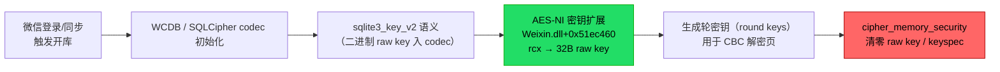
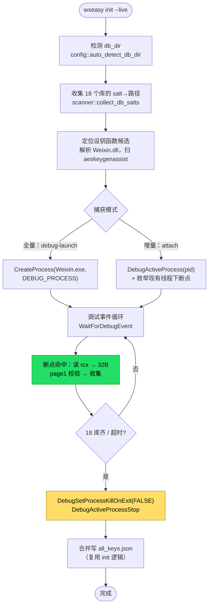
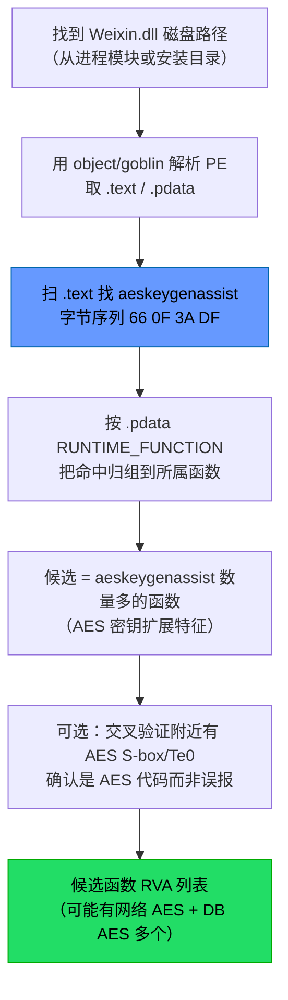
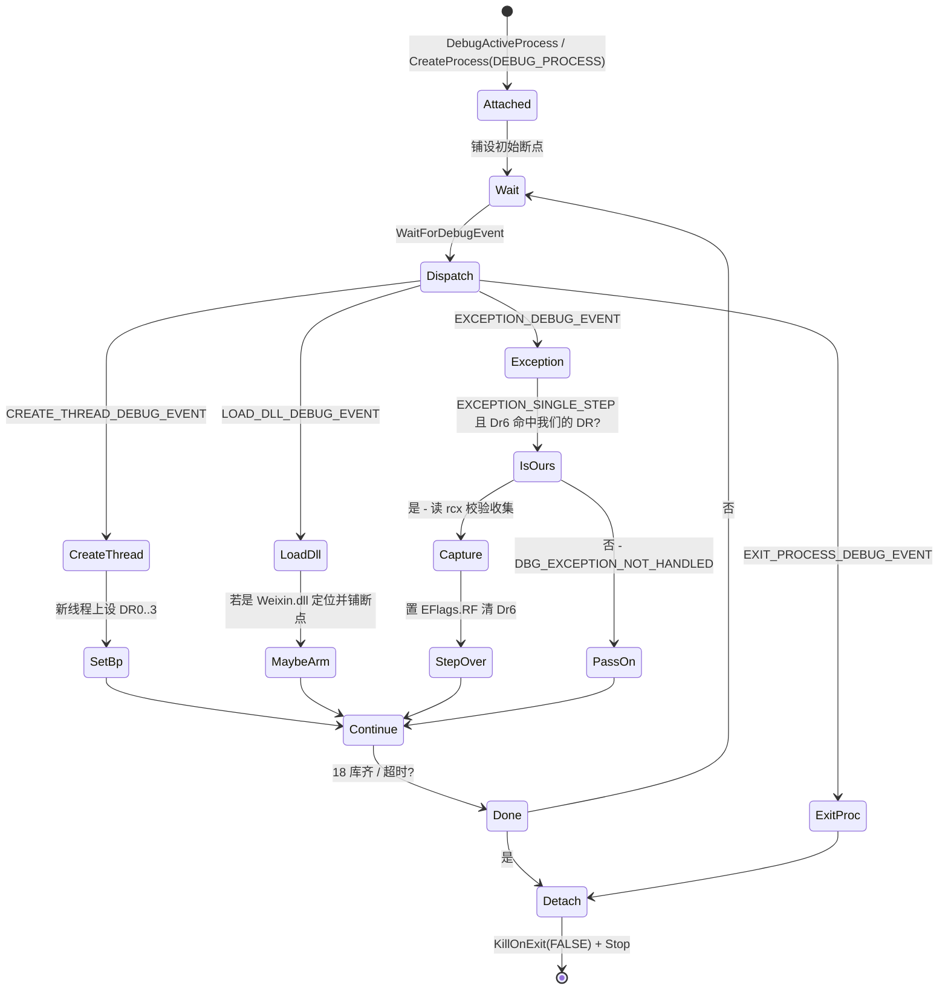
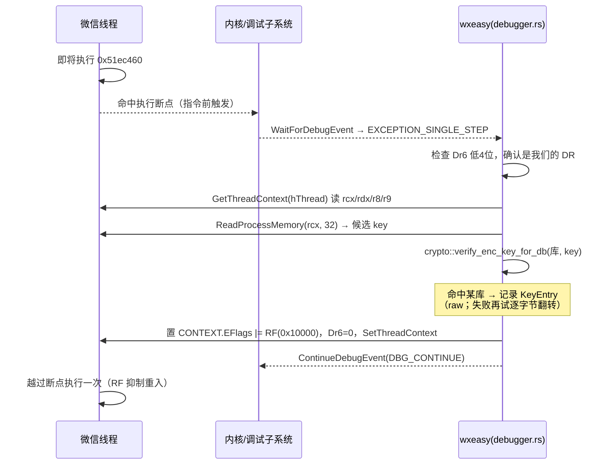
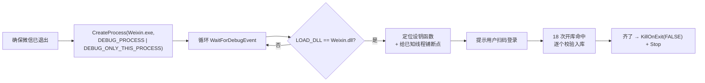
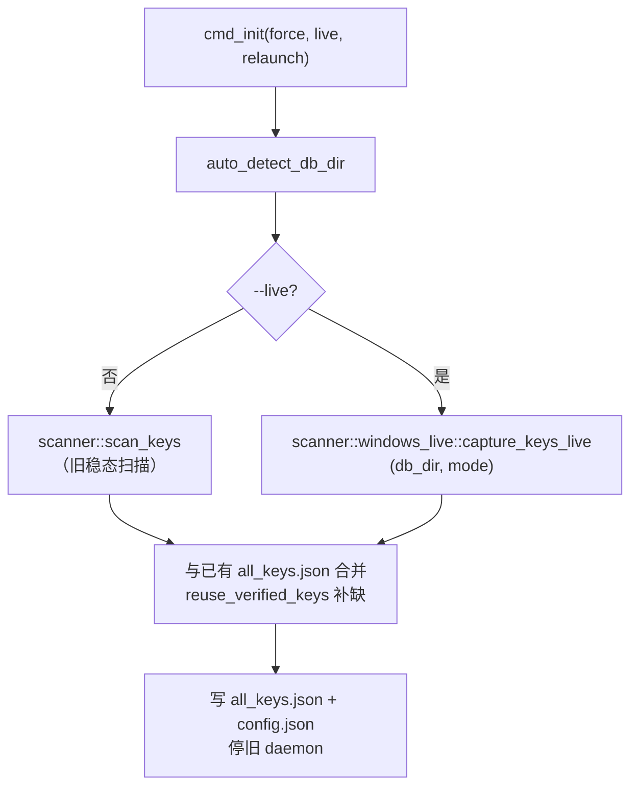
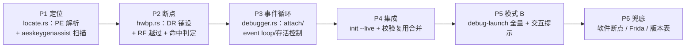

# 微信 4.1.11+ 密钥提取：纯 Rust 升级方案（调试器 + 硬件断点）

> 面向 **Windows 微信 4.1.10+（实测 4.1.11.24）**。旧的「稳态扫内存找 `x'<key><salt>'`」在这些版本失效，本方案用**开库瞬间动态断点**截获 raw key，全部用 **纯 Rust + Win32 API** 实现，不依赖 Frida / Python / 注入 DLL。
>
> 背景与旧方案的限制见 [windows-4.1.10-keys-and-reuse.md](./windows-4.1.10-keys-and-reuse.md)。

---

## 一、为什么要升级

| | 旧 scanner（`src/scanner/windows.rs`） | 本方案（live hook） |
|---|---|---|
| 原理 | 稳态遍历进程内存，正则匹配 keyspec / raw key | 在**设钥函数入口**下断点，命中时读寄存器拿 raw key |
| 4.1.10+ | **失效**：`cipher_memory_security` 用完即擦，稳态 0 命中 | **有效**：命中发生在清零之前 |
| 依赖 | 仅 `OpenProcess` / `ReadProcessMemory` | 增加 Win32 调试 API + 硬件断点 |
| 触发条件 | 无（随时扫） | 需微信**正在开库**（登录 / 同步 / 打开会话） |

**已验证事实（2026-07-28 实测）**：微信 4.1.11.24 登录同步、打开 `message_0.db` 的瞬间，在 AES-NI 密钥扩展函数 `Weixin.dll+0x51ec460` 入口，`rcx` 直接指向 32 字节 raw key（offset 0，无字节序变换）。抓到的 key 通过 page1 强校验，且与 `~/.wxeasy/all_keys.json` 已知可用 key 逐字节一致。

**关键机制约束**：raw key 只在开库那一刻明文存在，随即被 `cipher_memory_security` 清零。所以捕获**必须在断点在场时发生一次开库**。空闲的微信、停在登录界面的微信都抓不到。

---

## 二、方法回顾（已用 Frida 验证的路径）

微信本地库仍是 SQLCipher4 用法（32 字节 raw key 直接作 AES key），**页加解密走 AES-NI 硬件指令**（`aesenc`/`aesdec`/`aeskeygenassist`），不是查表 AES。

设钥数据流：



**截获点就是 D**：在 `0x51ec460` 入口下断点，命中时 `rcx` 指向的 32 字节就是 raw key，早于 F 的清零。

> 关键坐标（**4.1.11.24 专属**，换版本必须重新定位）：
> - AES-NI 密钥扩展：`Weixin.dll + 0x51ec460`（含 31 条 `aeskeygenassist`）
> - pragma 分发器（定位锚点，可抓真实 salt）：`0x5104970`
> - AES 表 Te0：`0x877dda0` / `0x881c9b0`（用于确认 AES 实现位置）

---

## 三、技术选型：调试器 + 硬件断点（不用 Frida）

纯 Rust 要在别的进程函数入口「拦一刀」，有三条路：

| 方案 | 是否改目标内存 | 是否注入代码 | 隐蔽性 | 复杂度 | 结论 |
|---|---|---|---|---|---|
| **硬件断点（DR 寄存器）** | 否 | 否 | 高 | 中 | ✅ **首选** |
| 软件断点（INT3 `0xCC`） | 是（打补丁） | 否 | 低（易被校验/反调试发现） | 中 | 备选 |
| Inline hook / 注入 trampoline | 是 | 是 | 低 | 高 | 不用 |

**选硬件断点的理由**：
- **不修改目标内存**——不会触发 WCDB/微信的代码完整性校验，也不留 `0xCC` 痕迹。
- x64 有 4 个调试地址寄存器 `Dr0`–`Dr3`，`Dr7` 控制启用与断点类型（执行/读/写）。对函数入口用「执行断点」。
- 已用 Frida（同样走调试语义的 attach）验证微信**无反注入拦截**，普通调试大概率也放行。若个别环境被反调试拦，再退回软件断点或 Frida 兜底（见 §十一）。

**只需 Win32 调试 API + 线程上下文操作，`windows` crate 现有 feature 已基本覆盖**（`Win32_System_Diagnostics_Debug` / `Win32_System_Threading` / `Win32_System_Diagnostics_ToolHelp` / `Win32_Foundation` 均已启用）。

---

## 四、总体架构



**模块划分（新增，Windows only）**：

```
src/scanner/
  windows.rs              # 旧 scanner（保留，≤4.1.9 兼容 & 兜底）
  windows_live/           # 新增
    mod.rs                # 对外入口 capture_keys_live(db_dir, mode) -> Vec<KeyEntry>
    locate.rs             # 解析 Weixin.dll，定位 aeskeygenassist 函数候选
    debugger.rs           # 调试事件循环 + 附加/分离/存活控制
    hwbp.rs               # 硬件断点：DR 寄存器读写、多线程铺设、命中判定
```

**复用现有代码**：
- `crate::crypto::verify_enc_key_for_db` —— page1 强校验（`SQLITE_PAGE1_META_PREFIX`）。
- `crate::scanner::{collect_db_salts, read_db_salt, KeyEntry}` —— 库枚举与 salt→库映射。
- `crate::cli::init` —— 写 `all_keys.json` / `config.json`、drop 权限、停旧 daemon。
- 旧 `windows.rs` 作为兜底：`--live` 失败时回退到稳态扫描 + `reuse_verified_keys`。

---

## 五、设钥函数定位（版本鲁棒，不写死 RVA）

`0x51ec460` 是 4.1.11.24 专属偏移，微信一升级就变。要长期可用，必须**运行时按特征定位**。



**要点**：
1. **多候选无妨**——微信里有多套 AES（网络 mmtls + 两套 SQLCipher）。全部下断点，靠 page1 校验筛出真正解得开库的那个 key，剩下的（网络 key 等）自然被淘汰。这正是我实测时「401/216 个候选里只有能解库的才留下」的逻辑。
2. **PE 解析**：新增轻量依赖 `object`（纯 Rust，无 C 依赖，跨平台 check 友好）或 `goblin`。只读磁盘上的 `Weixin.dll`，不动进程。
3. **`.pdata` 提供精确函数边界**（x64 PE 的 `IMAGE_RUNTIME_FUNCTION_ENTRY` 表），把 `aeskeygenassist` 命中准确归到函数入口——这正是断点地址。
4. **RVA → 运行时 VA**：`模块基址 + RVA`。模块基址用 ToolHelp `Module32First/Next`（`TH32CS_SNAPMODULE`）拿 `Weixin.dll` 的 `modBaseAddr`。

> 兜底：若特征扫描失败（微信换了 AES 实现），可读一份「已知版本→RVA」表按 `FileVersion` 命中，实测偏移作为快速通道；两条路都失败再回退旧 scanner。

---

## 六、调试事件循环

附加后进入标准 Win32 调试循环。**核心是把硬件断点铺到所有会执行到设钥函数的线程上**，并在命中时读寄存器。



**两处易错点**：

- **多线程铺断点**。DR 寄存器是**每线程**的（在 `CONTEXT` 里）。
  - *attach 模式*：附加时不会为已存在线程发 `CREATE_THREAD` 事件 → 必须用 ToolHelp（`TH32CS_SNAPTHREAD` + `Thread32First/Next`）枚举该进程所有 TID，逐个 `OpenThread` → `GetThreadContext`/`SetThreadContext` 设 DR。
  - *debug-launch 模式*：线程都在附加后创建 → 在 `CREATE_THREAD_DEBUG_EVENT` 里给每个新线程设 DR（覆盖最完整，推荐用于全量抓取）。
- **进程存活**。调试器退出时默认会**杀掉被调试进程**。分离前必须 `DebugSetProcessKillOnExit(FALSE)`，再 `DebugActiveProcessStop(pid)`，否则会把用户的微信一起关掉。

---

## 七、硬件断点：铺设与命中处理

### 7.1 铺设执行断点（以 Dr0 为例）

```text
Dr0   = 目标 VA（设钥函数入口）
Dr7  |= 1<<0            // L0：本地启用 Dr0
Dr7 位 16..17 (RW0) = 00 // 执行断点
Dr7 位 18..19 (LEN0) = 00 // 执行断点长度必须 00
```

用 `GetThreadContext`（`ContextFlags = CONTEXT_DEBUG_REGISTERS | CONTEXT_CONTROL | CONTEXT_INTEGER`）读出 `CONTEXT`，改 `Dr0`/`Dr7`，`SetThreadContext` 写回。多个候选函数用 `Dr0`–`Dr3`（最多 4 个）；候选超过 4 个时分批，或退回软件断点。

> `CONTEXT` 需 16 字节对齐——`windows` crate 的 `CONTEXT` 已 `#[repr(align(16))]`，直接栈上分配即可。

### 7.2 命中处理时序



**关键细节**：
- **执行断点在「指令执行前」触发**：若直接 continue 会在同一条指令上无限重入。标准解法：命中后置 **`EFlags.RF`（Resume Flag，bit16）**，`SetThreadContext` 写回，再 `ContinueDebugEvent`——CPU 会把这条指令执行一次而不重新触发断点。
- **读哪个寄存器**：实测 4.1.11.24 的 `0x51ec460` 是 `rcx` off 0。为鲁棒，按 `rcx → rdx → r8 → r9` 顺序、各取「直接 32B」与「解一层指针后 32B」，都送 page1 校验；命中即停。同时保留「逐字（4 字节）翻转」变体（应对个别函数按大端 `GETU32` 装载 key 的情况——本函数用不到，但多候选时有用）。
- **Dr6 清零**：命中后把 `Dr6` 置 0，避免下次判定串扰。

### 7.3 校验（复用现成代码）

```rust
// 伪代码：命中时
let cand: [u8; 32] = read_process_memory(h, rcx, 32)?;
for (db_name, db_path) in &unmatched_dbs {
    if crate::crypto::verify_enc_key_for_db(db_path, &cand) {
        found.insert(db_name.clone(), KeyEntry { db_name, enc_key: hex(cand), salt });
        break;
    }
}
```

`verify_enc_key_for_db` 已实现 page1 强校验（解密首页后偏移 16 处应为 `10 00 02 02 50 40 20 20`），直接复用，零新增密码学代码。

---

## 八、两种捕获模式

| 模式 | 触发方式 | 覆盖 | 适用 |
|---|---|---|---|
| **A. attach 增量** | 附加**已登录**微信，枚举现有线程下断点，随用随抓 | 只抓「断点在场期间打开」的库；靠日常使用/同步逐步凑齐 | 不想重启微信；接受 key 逐步补齐 |
| **B. debug-launch 全量** | wxeasy 以 `DEBUG_PROCESS` 启动 Weixin.exe，`Weixin.dll` 加载后铺断点，用户登录 → 18 库集中打开全在覆盖下 | 一次抓全 | 首次初始化、要一次到位 |

**模式 B 流程补充**：



> 注意：微信可能经 launcher 拉起真正主进程。若 `DEBUG_ONLY_THIS_PROCESS` 抓不到主进程，改用 `DEBUG_PROCESS`（跟子进程）并在 `CREATE_PROCESS`/`LOAD_DLL` 事件里认准加载 `Weixin.dll` 的那个。实测**只有主进程加载 Weixin.dll**，渲染子进程不加载。

**实测教训（务必写进交互提示）**：反复强杀 + 重启微信会触发**重新认证卡在登录界面**。模式 B 要**优雅退出**微信（或直接让用户手动重开），并明确告诉用户「需要扫码登录一次」。

---

## 九、权限模型

- **需要管理员权限**：调试其他进程要 `SeDebugPrivilege`。流程：`OpenProcessToken(GetCurrentProcess(), TOKEN_ADJUST_PRIVILEGES)` → `LookupPrivilegeValue(SE_DEBUG_NAME)` → `AdjustTokenPrivileges` 启用。wxeasy `init` 本就要管理员（旧 scanner 的 `OpenProcess` 也需要），不额外抬高门槛。
- **权限边界不变**：抓完 key、写文件前，沿用 `init` 现有的「扫描用管理员、随后 drop 到调用用户」策略（Windows 侧主要是确保 `all_keys.json` 落在用户目录且收紧 ACL）。
- **`windows` crate feature**：调试/上下文相关 API 在已启用的 `Win32_System_Diagnostics_Debug` / `Win32_System_Threading` 下；`SeDebugPrivilege` 的 token 操作用 `Win32_Security`（已启用）。改完 `Cargo.toml` 记得 `cargo update --workspace` + 跨平台 `cargo check`（见项目规则）。

---

## 十、与现有 wxeasy 的集成

**CLI**（`src/cli/init.rs` / `src/cli/mod.rs`）：

```
wxeasy init                # 现状：旧 scanner + 校验复用
wxeasy init --live         # 新：调试器 attach 增量抓取（默认模式 A）
wxeasy init --live --relaunch  # 模式 B：debug-launch 全量
```

**调用链**：



- **合并策略**：live 抓到的优先，未覆盖的库用旧 `all_keys.json`（经 page1 校验）补齐——直接复用 `reuse_verified_keys`。这样即便模式 A 只抓到部分库，配合历史密钥也能凑全。
- **平台隔离**：`windows_live` 整个 `#[cfg(target_os = "windows")]`；macOS/Linux 的 `--live` 编译期给出「暂不支持」提示，不影响其它平台 `cargo check`。

---

## 十一、风险、限制与缓解

| 风险 | 说明 | 缓解 |
|---|---|---|
| **反调试** | 微信未来可能检测 `BeingDebugged` / `NtQueryInformationProcess(ProcessDebugPort)` | 硬件断点不改内存、最隐蔽；Frida attach 已证明当前无拦截；必要时 PEB `BeingDebugged` 置零（谨慎，属升级手段）；再不行退回 Frida 兜底 |
| **必须开库才有 key** | 空闲/登录界面抓不到 | 明确交互提示：模式 A 让用户「打开几个会话/等同步」；模式 B「重开并扫码登录」 |
| **多线程漏断点** | 新线程未铺 DR 会漏命中 | attach 模式枚举全部现有线程；launch 模式在 `CREATE_THREAD` 事件铺；两者结合 |
| **进程被误杀** | 调试器退出默认杀 debuggee | 分离前 `DebugSetProcessKillOnExit(FALSE)` |
| **版本漂移** | RVA 写死会失效 | 特征扫描（`aeskeygenassist` + `.pdata`）定位；版本表兜底；旧 scanner 兜底 |
| **多套 AES 误命中** | 网络 AES 也会命中断点 | 所有候选都下断，page1 校验筛真 key，其余淘汰 |
| **断点开销** | 密钥扩展仅每库一次（~18 次），极低频 | 命中处理要快；不要断在每页解密的热函数上 |
| **稳定性** | 命中时线程被短暂挂起 | 只断低频的密钥扩展入口；处理逻辑无阻塞 IO |

**明确不做**：注入 DLL、改目标代码、绕过账号登录态、远程偷钥。全部在本机、用户自己的数据、需管理员显式授权。

---

## 十二、分阶段实施计划



1. **P1 定位**：离线单测——用磁盘 `Weixin.dll` 跑通「扫 `aeskeygenassist` → `.pdata` 归组 → 候选 RVA」，对 4.1.11.24 应能命中含 `0x51ec460` 的函数。
2. **P2 断点**：在一个自写的小测试进程上验证「设 DR0 执行断点 → 命中 → 读寄存器 → RF 越过 → 不重入」。
3. **P3 事件循环**：attach 真实微信，验证多线程铺断点 + 命中读 `rcx` + 分离后微信存活。
4. **P4 集成**：接进 `init --live`，page1 校验、与 `all_keys.json` 合并、写盘、停 daemon。
5. **P5 模式 B**：debug-launch 全量 + 「请扫码登录」交互，一次抓齐 18 库。
6. **P6 兜底**：软件断点 / Frida / 版本表三级回退，反调试与版本漂移的保险。

**每步遵守项目规则**：改动后 `cargo check`；动 `Cargo.toml` 后 `cargo update --workspace` + 跨平台 `cargo check --target x86_64-unknown-linux-gnu / x86_64-pc-windows-gnu`；commit 后 push `wxeasy main`。

---

## 附录 A：关键 Win32 API 清单

| 用途 | API | `windows` feature |
|---|---|---|
| 提权 | `OpenProcessToken` / `LookupPrivilegeValueW` / `AdjustTokenPrivileges`（`SE_DEBUG_NAME`） | `Win32_Security` / `Win32_System_Threading` |
| 附加/分离 | `DebugActiveProcess` / `DebugActiveProcessStop` / `DebugSetProcessKillOnExit` | `Win32_System_Diagnostics_Debug` |
| 启动调试 | `CreateProcessW`（`DEBUG_PROCESS` / `DEBUG_ONLY_THIS_PROCESS`） | `Win32_System_Threading` |
| 事件循环 | `WaitForDebugEvent` / `ContinueDebugEvent` / `DEBUG_EVENT` | `Win32_System_Diagnostics_Debug` |
| 线程上下文 | `OpenThread` / `GetThreadContext` / `SetThreadContext` / `CONTEXT` | `Win32_System_Diagnostics_Debug` / `Win32_System_Threading` |
| 读内存 | `ReadProcessMemory` | `Win32_System_Diagnostics_Debug` |
| 枚举线程/模块 | `CreateToolhelp32Snapshot` / `Thread32First/Next` / `Module32First/Next` | `Win32_System_Diagnostics_ToolHelp` |

## 附录 B：关键常量

```text
EXCEPTION_SINGLE_STEP      = 0x80000004   // 硬件断点命中的异常码
EFlags.RF (Resume Flag)    = 1 << 16      // 越过执行断点、抑制重入
Dr7.L0                     = 1 << 0       // 本地启用 Dr0
Dr7.RW0 (bits16..17)       = 00b          // 执行断点
Dr7.LEN0(bits18..19)       = 00b          // 执行断点长度固定 00
Dr6 低 4 位                 // 指示 Dr0..Dr3 哪个命中
SQLITE_PAGE1_META_PREFIX   = 10 00 02 02 50 40 20 20  // page1 校验魔数（已在 crypto/mod.rs）
aeskeygenassist 字节        = 66 0F 3A DF  // 定位 AES 密钥扩展函数
```

---

## 附录 C：与旧文档/代码对应

| 能力 | 位置 |
|---|---|
| 旧稳态扫描（≤4.1.9 & 兜底） | `src/scanner/windows.rs` |
| page1 强校验 | `src/crypto/mod.rs`（`verify_enc_key_for_db`、`SQLITE_PAGE1_META_PREFIX`） |
| 库枚举 / salt 映射 | `src/scanner/mod.rs`（`collect_db_salts`、`read_db_salt`） |
| 校验复用合并 | `src/cli/init.rs`（`reuse_verified_keys`） |
| 新增 live hook（本方案） | `src/scanner/windows_live/`（`locate.rs` / `hwbp.rs` / `debugger.rs`） |
| 背景与失效分析 | [windows-4.1.10-keys-and-reuse.md](./windows-4.1.10-keys-and-reuse.md) |

> 署名：okooo5km（十里）
